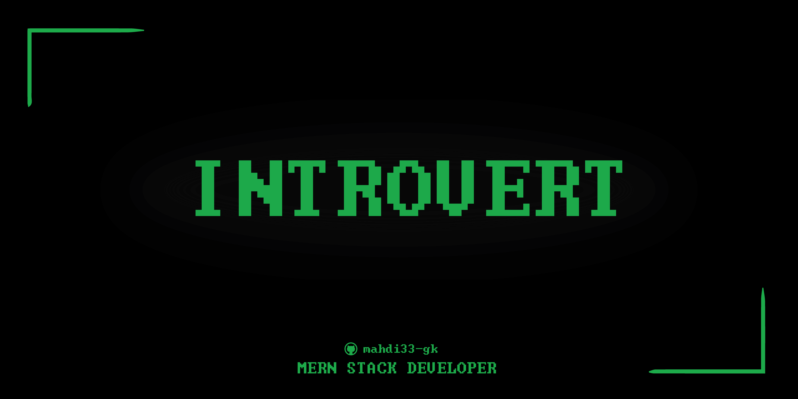

<h1 align="center">Hi there, I'm Mehedi 👋</h1>

  <h3>A MERN Stack Developer 🚀</h3>
  
  
  

###
<h2>👨‍💻 About Me</h2>

I am a Frontend Developer passionate about crafting immersive user experiences. I specialize in HTML, CSS, JavaScript, Tailwind CSS, and React.js, building responsive and dynamic web applications. With a keen eye for design and performance, I ensure seamless user experiences across various devices.
 
  <h3>Tech Stack:</h3>
🔹 HTML, CSS, JavaScript, Tailwind CSS, React.js  
🔹 UI Libraries: DaisyUI, ShadCN  
🔹 Backend & APIs: Node.js, Express.js, REST APIs  
🔹 Database: MongoDB, Firebase  
🔹 Version Control: Git & GitHub  
🔹 Other Skills: Responsive Design, UI/UX, API Integration  
🔹 Additional Expertise: Geoinformatics (Spatial Data Analysis)  
  

 ---

🔭 I’m currently studying for a diploma in engineering with a focus on Computer Science and Technology (CST). 📚 I'm learning web development and related technologies to build a strong foundation for my future career. ⚡ In my free time, I enjoy exploring coding challenges, innovative web design, and staying updated with tech trends.

---

 
  
##  **Github Stats:**

 
 
  

 

---

<h3> 🤝🏻 Connect with Me </h3>

<!--
**mahdi33-gk/mahdi33-gk** is a ✨ _special_ ✨ repository because its `README.md` (this file) appears on your GitHub profile.

Here are some ideas to get you started:

- 🔭 I’m currently working on ...
- 🌱 I’m currently learning ...
- 👯 I’m looking to collaborate on ...
- 🤔 I’m looking for help with ...
- 💬 Ask me about ...
- 📫 How to reach me: ...
- 😄 Pronouns: ...
- ⚡ Fun fact: ...
-->
